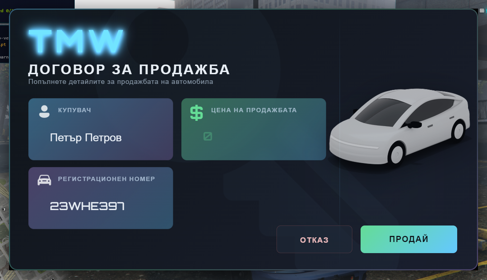

# TMW Vehicle Sale Contract

## 🚗 Описание
Редизайн на kzo_contract за QBCore с модерен минималистичен UI и система за цени при продажба на автомобили.

## ✨ Основни функции

### 💰 Система за цени
- Въвеждане на цена при продажба на автомобил (до 999,999,999)
- Автоматично прехвърляне на пари между играчи
- Проверка дали купувачът има достатъчно средства
- Поддръжка на плащане с кеш или банка

### 🎨 Модерен UI
- Минималистичен футуристичен дизайн
- TMW брандинг с анимирано лого
- Градиентни рамки с hover ефекти
- Плавни анимации и преходи
- Интуитивен интерфейс за продажба
- Визуализация на цената с форматиране
- Бутони за отказ и връщане назад

### 📊 Прогресбар система
- Прогресбар по време на подписване на договора
- Автоматично откриване на progressbar ресурс
- Fallback към QBCore прогресбар
- Анимации с клипборд
- Блокиране на движение по време на подписване

## 📋 Как се използва

### За играчи:
1. Вземете предмета 'contract' в инвентара си
2. Застанете близо до превозното средство и купувача
3. Използвайте предмета
4. Въведете цената на продажбата
5. Натиснете "ПРОДАЙ"
6. Прегледайте детайлите и натиснете "ПОТВЪРДИ"
7. Изчакайте прогресбара за подписване (11 сек за всеки играч)

### За администратори (тестване):
```bash
# Тестване на функционалността
/testcontract [номер] [цена]
# Пример: /testcontract ABC123 50000

# Тестване на UI
/testui
```

## 🔧 Конфигурация

В `server.lua` можете да промените:
- `itemname` - предметът, който се използва за договора (по подразбиране: 'contract')

## 💡 Особености

- ✅ Автоматична проверка на собствеността на превозното средство
- ✅ Проверка на наличните средства на купувача
- ✅ Прогресбар и анимации за подписване на договора
- ✅ Прехвърляне на ключовете към новия собственик
- ✅ Съобщения на български език
- ✅ Защита срещу невалидни транзакции
- ✅ Debug режим за разработчици

## 🎮 Изисквания

- QBCore Framework
- oxmysql
- qb-vehiclekeys (или друга система за ключове)
- progressbar или qb-progressbar (опционално)

## 🎨 UI Особености

- Минималистичен тъмен дизайн
- Градиентни граници (cyan → green → purple)
- TMW лого с пулсиращ ефект
- Цветово кодирани полета:
  - Cyan - информация за купувача
  - Purple - информация за превозното средство
  - Green - информация за цената
- Плавни hover ефекти
- Responsive дизайн

## 📝 Бележки

- Цената може да бъде до 999,999,999
- Купувачът трябва да има парите в кеш или банка
- Продавачът получава парите директно след потвърждение
- Превозното средство се прехвърля автоматично в базата данни
- Прогресбарът е 11 секунди за всеки играч (общо 22 секунди)

## 🔄 Промени спрямо оригинала

- ✨ Напълно преработен UI с минималистичен дизайн
- 💰 Добавена система за цени
- 📊 Добавен прогресбар при подписване
- 🎨 TMW брандинг
- 🇧🇬 Превод на български език
- 🔧 Подобрена валидация и error handling
- 🐛 Debug режим за разработчици

## 📸 Preview



## 👨‍💻 Автор

Базиран на kzo_contract  
Редизайн и нови функции: TMW

## 📄 Лиценз

Escrow ignored files: `client.lua`, `server.lua`
